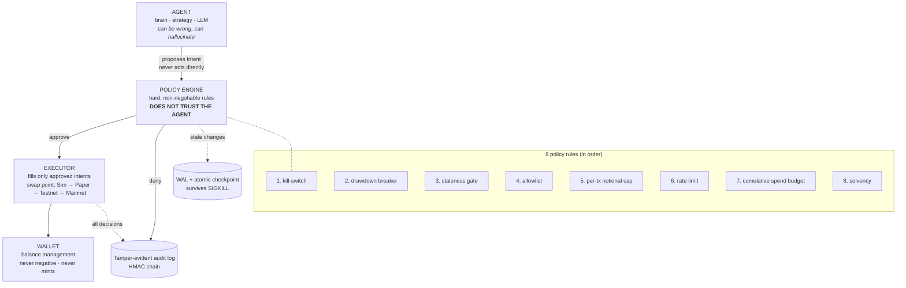

# TreasuryForge

> **Safety architecture for autonomous agents — case study: crypto treasury.** A 4-layer guardrail pattern (Agent → Policy → Executor → Wallet) where the policy engine does NOT trust the agent, paired with crash-safe state, tamper-evident audit chains, and statistically honest validation. The architecture transfers directly to any agentic AI system that takes irreversible actions.

[](https://www.python.org/downloads/)
[](#tests)
[](#)
[](#)

---

## What this proves (for hiring managers reading the code)

| Capability | Evidence |
|---|---|
| **Multi-layer agent safety design** | Agent proposes Intent → PolicyEngine evaluates 8 hard rules → Executor fills only approved → Wallet enforces balance invariants. **The policy layer does NOT trust the agent.** Same pattern applies to LLM-driven tool calls, robotics motor control, payment systems |
| **Crash-safe durable state** | WAL ledger (append-only JSONL) + atomic checkpoint via `os.replace()` (POSIX & Windows). Subprocess `SIGKILL` test proves circuit breaker survives a hard kill without silent un-trip |
| **Tamper-evident audit trail** | HMAC-SHA256 hash-chained decision log (`prev_hash + canonical-JSON`). Walk-forward verification detects any reorder/delete. **Stdlib only** — no asymmetric crypto, no external deps |
| **Statistically honest validation** | Deflated Sharpe Ratio (Bailey–López de Prado) corrects for selection bias from N tried configs. Purged + embargoed K-fold CV prevents time-series leakage. **Pattern applies to ML model selection gates** |
| **Property-based safety fuzzing** | Hypothesis drives thousands of arbitrary market histories through the real loop and asserts 8 invariants (determinism, conservation, no-negative-balances, breaker-trips-and-stays-tripped, etc.) |
| **Stage-ladder promotion gates** | PAPER → MICRO (0.5–1%) → SMALL (2–3%) → NORMAL (5–10%) with live-vs-shadow parity checks (edge retention, slippage ratio, max DD). **Pattern transfers directly to ML model deployment (shadow → canary → blue-green)** |
| **Backtest-live parity by construction** | Decomposed transaction-cost model (spread + market impact via √-law + fees) **shared between backtest and live**. Decision at tick `t`, fill at `t+1` — eliminates the #1 backtest bug |
| **Quantitative rigor with research provenance** | Implements published quant papers in full: Moskowitz–Ooi–Pedersen TSMOM, Bailey–López de Prado DSR, RiskMetrics EWMA vol. The roadmap explicitly **rejects** TSMOM/pairs-arb with evidence — not every idea ships |

**By the numbers** — 46 core modules · 77 test suites · 17,700 LOC · 8 policy rules · zero keys / zero funds / zero network calls during validation

---

## The one idea that matters



The agent never touches the wallet. It only *proposes*. A separate policy layer applies hard limits and only approved intents reach execution.

**In a real system, the policy is enforced by the wallet itself** (MPC session caps / smart-account policy). Here it's enforced in code so we can validate the logic risk-free. Same pattern, swap the executor — the agent, policy, wallet, runner, and every test stay unchanged.

---

## Transferability to AI agents

This is not a crypto bet. It's a **reference implementation of agent safety**:

| TreasuryForge concept | Direct AI agent equivalent |
|---|---|
| Agent proposes `Intent` | LLM proposes tool call |
| Policy approves/denies | Tool-use guardrail (allowlist + rate limit + cost budget + kill-switch) |
| Executor swap point | Tool execution layer (sandboxed vs production) |
| WAL + checkpoint | Conversation/agent state recovery after crash |
| HMAC audit chain | Tamper-evident agent decision log for compliance (SOX, LFPDPPP, etc.) |
| Stage-ladder promotion | Model deployment: shadow → canary → blue-green |
| Deflated Sharpe + purged CV | Honest A/B testing of prompts/models with selection-bias correction |
| Hypothesis fuzzing | Property-based testing for agent invariants (idempotency, conservation, etc.) |

These patterns are extracted as a standalone library in [**agentguard**](https://github.com/christianescamilla15-cell/agentguard) (sibling project — work in progress).

---

## Run it

```bash
python -m pytest -q                              # 77 test suites
python run_demo.py --steps 120                   # normal market
python run_demo.py --crash --steps 80            # crash → circuit breaker trips
python run_demo.py --crash --ledger              # print full audit ledger
```

## Modules

| File | Role | Real-world counterpart |
|------|------|------------------------|
| `agent.py` | brain — proposes intents (deterministic mean-reversion baseline) | LLM / strategy engine |
| `policy.py` | **the guardrail** — 8 hard rules, trusts nothing, crash-safe state | wallet session caps / smart-contract policy |
| `executor.py` | fills an approved intent (**the swap point**) | Kraken paper / Coinbase AgentKit on testnet |
| `wallet.py` | balances, never goes negative, never mints value | MPC / agentic wallet |
| `market.py` | deterministic seeded price feed | real market data feed |
| `runner.py` | the 24/7 loop, t+1 fills, journal + audit hooks | service loop (nssm / VPS) |
| `journal.py` | crash-only WAL + atomic state checkpoints | durable ops state |
| `audit.py` | HMAC hash-chained tamper-evident decision log | compliance / forensics |
| `sizing.py` | vol-targeting size ceiling (never breaches the cap) | risk sizing |
| `deployment_gate.py` | stage-ladder promotion (PAPER → MICRO → SMALL → NORMAL) | ML model promotion gate |
| `consultants.py` | perspective-diverse supervisor committee gating every deploy | adversarial verifier panel for agent actions |
| `backtest/` | CostModel + Sharpe/DSR + purged-CV promotion gate | "validate before funds" / "validate before deploy" |

### Phase-2 hardening (implemented, all validated in Sim)

Driven by a 164-agent deep-research pass (see [PHASE2_DISCOVERY.md](PHASE2_DISCOVERY.md)). The policy engine enforces **8 rules** in order: kill-switch → drawdown breaker → staleness → allowlist → per-tx notional cap → rate limit → cumulative spend budget → solvency.

- **Crash-safe latched state** — fixes a real bug research found: the breaker and drawdown anchor were in-memory, so a restart silently un-tripped the breaker. State is now journaled (atomic `os.replace`) and restored on startup. **Subprocess `os._exit(1)` crash test proves the breaker survives a hard kill.**
- **Spend budget** (`max_notional_per_window`) closes the drip-drain gap a count-only rate limit leaves open.
- **Point-in-time / t+1 fills** — the agent decides on tick `t` but fills at `t+1`, so it can never trade on the bar it is still forming.
- **Tamper-evident audit log**, **vol-targeting sizing ceiling**, **decomposed transaction-cost model**, and a **cost-and-overfitting-aware backtest gate** (Deflated Sharpe + purged/embargoed CV).
- **Property-based fuzzing** with `hypothesis` drives thousands of arbitrary histories through the real loop and asserts every safety invariant.

## Validation gates (what "it works correctly" means here)

- **Deterministic** — same seed → identical fills and final equity (bit-exact)
- **Conservation** — final equity reconciles exactly to fills + fees; the system can only bleed friction, never create value out of thin air
- **No negative balances** — ever, across full runs
- **Every guardrail provably fires** — kill switch, allowlist, notional cap, rate limit, drawdown breaker (trips and stays tripped), solvency
- **Audit chain integrity** — any reorder/insert/delete in the decision log is detected by walk-forward HMAC verification

Note: the circuit breaker *stops further trading*; it does not reverse a loss on a position already held while the market falls. That's realistic — a breaker limits additional damage, it doesn't undo the market.

## Going real later (separate, deeper discovery — do NOT skip the gates)

The only file that changes is `executor.py`. Add a new class with the same `execute(intent, tick, wallet)` signature:

1. **Paper** — `PaperExecutor` backed by Kraken CLI paper mode. Still no funds.
2. **Testnet** — `OnchainExecutor` via Coinbase AgentKit + MPC/agentic wallet on Base Sepolia. Real signing, fake money. Caps set ridiculously low.
3. **Mainnet** — same, tiny caps first, scaled only after on-chain proof that the limits and kill switch hold.

The agent, policy engine, wallet abstraction, runner and every test stay unchanged. **That's the payoff of validating the architecture first.**

## Honest discernment

The roadmap explicitly REJECTS strategies that don't clear the bar:
- **TSMOM** (time-series momentum) — rejected by Deflated Sharpe analysis (negative after selection-bias correction)
- **Statistical arbitrage on pairs** — rejected by regime-shift stress and profit factor

See [ROADMAP.md](ROADMAP.md) and [RESEARCH_strategies.md](RESEARCH_strategies.md) for the gate-based decision trail. **Building to be REJECTED until the evidence clears the bar** is the discipline this project enforces.

---

## Author

**Christian Hernández Escamilla** — AI Engineer · Multi-Agent Orchestration · Production Reliability
[GitHub](https://github.com/christianescamilla15-cell) · christianescamilla15@gmail.com
